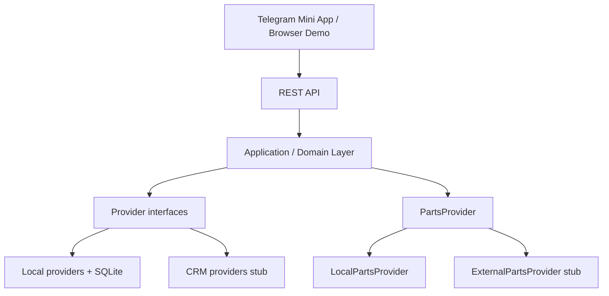

# Telegram Auto Service Mini App

Клиентский портал автосервиса в Telegram Mini App: **автомобиль → услуга или проблема → запись → диагностика → согласование → работа → история**.

Это отдельный продукт линейки CRM-ready Telegram Mini Apps. Не fork и не reskin Barber / Beauty / Massage: отдельный domain model, PartsProvider и automotive UI.

Сейчас Mini App работает на собственном demo backend (`DATA_MODE=local`, SQLite). Если предоставить API CRM-партнёра, local providers заменяются CRM adapters, а пользовательский интерфейс и application logic остаются прежними.

## Product purpose

`Норд Авто` — white-label Telegram-приложение для независимого автосервиса:

- хранить автомобили клиента;
- записаться на плановую услугу;
- создать заявку, если услуга неизвестна;
- пройти диагностику и согласовать работы/запчасти;
- видеть историю и повторить обслуживание.

## Architecture



Режим задаётся на composition layer (`backend/src/container.ts`), не ветвлениями `if (crmMode)` в application code:

- `DATA_MODE=local` — SQLite source of truth.
- `DATA_MODE=crm` — CRM provider stub, контролируемый `501 CRM_NOT_CONFIGURED`.
- `PARTS_PROVIDER=local` — локальный каталог запчастей.
- `PARTS_PROVIDER=external` — stub `501 PARTS_NOT_CONFIGURED`.

Provider boundaries:

- CustomerProvider
- VehicleProvider
- CatalogProvider
- SpecialistProvider
- ResourceProvider
- AvailabilityProvider
- BookingProvider
- ServiceRequestProvider
- EstimateProvider
- PartsProvider
- HistoryProvider

## Domain model

Клиентский поток строится вокруг автомобиля, а не каталога услуг.

Ключевые сущности: Customer, Vehicle, Service, Specialist, Resource, Appointment, ServiceRequest, Inspection, Estimate, EstimateItem, Part, VehiclePartFitment.

Статусы записи: `booked → arrived → diagnosing → waiting_approval → in_progress → completed` (+ `cancelled`, `no_show`).

Клиент видит русские labels, не технические enum names.

## Client UX

Главный экран показывает выбранный автомобиль, пробег, последнее обслуживание и CTA:

- Записаться
- Что-то сломалось
- История обслуживания

Клиент не выбирает подъёмник или пост. Backend атомарно назначает специалиста и resource.

## Stack

- Frontend: React, TypeScript, Vite, Telegram WebApp
- Backend: Express, TypeScript
- Database: SQLite, better-sqlite3, WAL
- Deploy shape: один Docker service, Express отдаёт `/api/*` и frontend static

## Local run

```bash
cp .env.example .env
npm install
npm run dev
```

- frontend: http://localhost:5173
- API: http://localhost:3000
- health: http://localhost:3000/api/health

```bash
npm test
npm run typecheck
npm run build
```

Сброс demo seed:

```bash
npm run seed:reset -w backend
```

## Docker run

```bash
docker compose up --build
```

Приложение слушает `http://localhost:3000`.

`GET /api/health` пример:

```json
{
  "ok": true,
  "dataMode": "local",
  "partsProvider": "local",
  "demoMode": true,
  "adminProtected": true
}
```

## ENV

| Variable | Default | Notes |
|---|---|---|
| `NODE_ENV` | `development` | `production` включает fail-closed admin |
| `PORT` | `3000` | HTTP port |
| `DATABASE_PATH` | `./data/autoservice.db` | runtime DB, не коммитится |
| `ALLOW_DEMO_MODE` | `true` | browser demo без Telegram initData |
| `APP_URL` | `http://localhost:5173` | CORS origin |
| `TZ` | `Europe/Moscow` | даты/слоты |
| `ADMIN_TOKEN` | empty | write-admin; в production без токена admin закрыт |
| `TELEGRAM_BOT_TOKEN` | empty | HMAC validation initData |
| `DATA_MODE` | `local` | `local` \| `crm` |
| `PARTS_PROVIDER` | `local` | `local` \| `external` |

Secrets не коммитить. Файл `.env` в `.gitignore`.

## Database

SQLite путь задаётся `DATABASE_PATH`. Migrations воспроизводимы (`backend/src/db/schema.ts`). Seed идемпотентен: повторный запуск не дублирует каталог. Для чистого demo — `npm run seed:reset -w backend`.

## Auth

- Telegram `initData` HMAC validation.
- Browser demo: `ALLOW_DEMO_MODE=true` → demo customer Иван Петров.
- Production без валидного initData и без demo mode не аутентифицирует клиента.

## Admin

- Write console: `/admin`, API `/api/admin/*`, защищён `ADMIN_TOKEN`.
- В production без `ADMIN_TOKEN` write API fail-closed.
- Read-only demo admin: `/demo/admin`, API `/api/demo-admin/*` только GET. Write → `405 DEMO_ADMIN_READ_ONLY`.

Разделы: Dashboard, Service Requests, Appointments, Customers, Vehicles, Services, Specialists, Resources, Schedule/Blocks, Parts, Estimates.

## Demo mode

Sales Demo Mode — guided tour по живому UI. Тур не создаёт записи и не меняет данные. Demo seed заранее содержит автомобиль, заявку, диагностику, смету и историю.

## CRM readiness

Контракт: [`docs/CRM.md`](docs/CRM.md). Vendor-specific CRM не реализован. Local SQLite — demo source of truth.

## PartsProvider

Контракт: [`docs/PARTS.md`](docs/PARTS.md). Local catalog для сценария диагностика → работы + запчасти → смета. TecDoc / supplier API не подключены.

## Tests

```bash
npm test
```

Backend покрывает availability (specialist/resource/blocks/eligibility), booking, double-booking, service request conversion, estimate totals/approval/rejection/fitment, status transitions, Telegram auth, admin fail-closed, demo-admin read-only.

## Deployment notes

Образ готов к одному сервису (Railway / VM / Docker). Production deploy **не выполнялся**. Перед боевым запуском нужны: Telegram bot, HTTPS URL, `ADMIN_TOKEN`, `TELEGRAM_BOT_TOKEN`, `ALLOW_DEMO_MODE=false` если demo не нужен, persistent volume для SQLite или замена на CRM.

## Known limitations

- нет реального CRM adapter;
- нет TecDoc;
- нет VIN decoding;
- нет оплаты;
- нет склада;
- нет бухгалтерии;
- нет полноценного заказ-наряда;
- нет интеграции с кассой;
- нет SMS/Telegram notifications;
- single-location demo.
